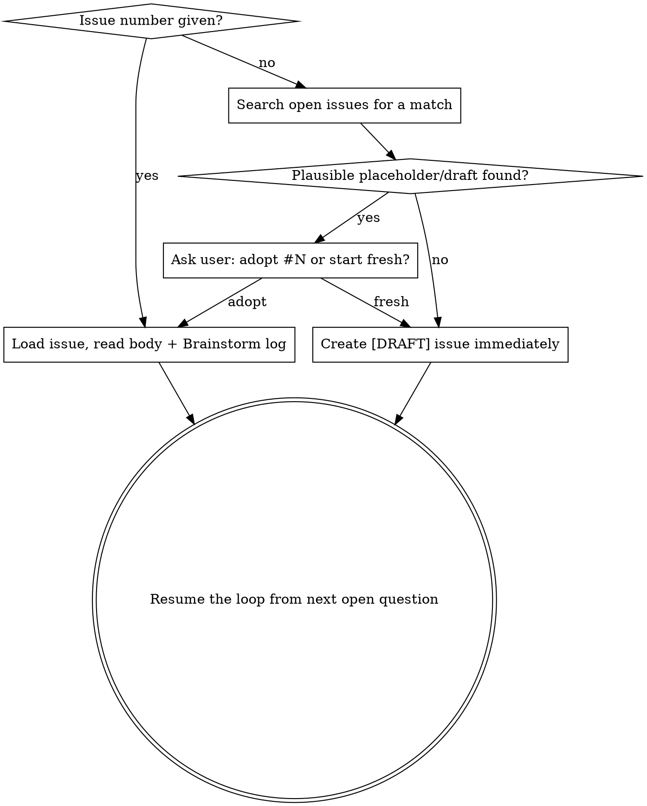

# Brainstorming Into a GitHub Issue

## Overview

Reuse the full `superpowers:brainstorming` dialogue, but persist the spec as a **GitHub issue** instead of a `docs/` file — and persist it **incrementally, across sittings**. The issue is created early with a `[DRAFT]` title prefix and rewritten after every answer, so you can walk away and resume anytime. On final approval the prefix is stripped and the issue becomes the durable "what/why" spec. This skill ends the moment the issue is finalized; implementation is a separate, later concern.

**Core principle:** brainstorming's *dialogue* is medium-agnostic and reused unchanged. Only its *persistence* (steps 6-9) is overridden — and here that persistence is a **resumable draft lifecycle**, not a single end-of-session write.

## When to Use

- You want a spec captured somewhere trackable and linkable, not buried in `docs/`.
- You want to brainstorm **over time** — start now, answer more questions later — without losing context between sittings.
- Building will happen later or by someone/something else — the issue is the handoff.

**When NOT to use:** you're about to implement immediately in this same session with no need for a durable spec artifact (use `superpowers:brainstorming` directly), or the spec belongs in a versioned design doc.

## State Model

Two title states, no new labels:

| Title | Meaning |
|---|---|
| `[DRAFT] feat(scope): summary` | brainstorm in progress (resumable) |
| `feat(scope): summary` | approved — reads like any normal repo spec issue |

Find in-progress drafts with: `gh issue list --search "[DRAFT] in:title"`

## Entry: Start, Dedupe, or Resume

Determine which mode you're in **before asking any questions**. Exact `gh` commands are in `issue-lifecycle.md`.

- **Issue number given** ("brainstorm gh issue 47") → this is the resume/adopt path. Load it. If it lacks the `[DRAFT]` prefix or the structured body, add them (fold any existing body text into Summary/Motivation) — see `issue-lifecycle.md`.
- **No number** → keyword-search open issues to **dedupe** (you may have already logged a placeholder). If a plausible match exists, surface it and **ask before adopting**. Never silently reuse.
- **No match** → create the `[DRAFT]` issue **immediately**, from the raw idea, with a mostly-TBD body. Do this *before* the dialogue so nothing is ever conversation-only.

## The Draft Lifecycle (core loop)

**REQUIRED SUB-SKILL:** Run `superpowers:brainstorming` for the dialogue — steps 1-5 exactly as written: explore context, clarifying questions **one at a time**, propose 2-3 approaches, present the design in sections, get **user approval**. Do NOT collapse this into a single self-answered pass; the one-question-at-a-time HIL loop is the point.

The difference from plain brainstorming is **persistence after every answer**:

1. Ask one question.
2. User answers.
3. **Immediately update the issue body** (see `issue-lifecycle.md`): fold the answer into the relevant spec section, check off the log item, and set the next `[ ]` question. This happens every round — not batched, not deferred to the end. A hard interruption after any answer must leave the issue current.
4. Repeat until the design is presented and approved.

The body is the living spec; a `## Brainstorm log` section (visible while draft) carries the checkboxed Q&A + the next open question, which IS the resume state.

<HARD-OVERRIDE>
`superpowers:brainstorming` ends by writing `docs/superpowers/specs/YYYY-MM-DD-<topic>-design.md`, committing it, and invoking `writing-plans`. When using THIS skill you do NONE of that:

- Do NOT write a spec file under `docs/`.
- Do NOT commit a spec doc.
- Do NOT invoke `writing-plans`. There is no plan step here.

The spec's only home is the GitHub issue.
</HARD-OVERRIDE>

## Finalize → Ready

When the design is approved:

1. **Spec self-review** on the issue body: scan for placeholders/TBDs, internal contradictions, scope creep, ambiguous requirements. Fix inline.
2. **Strip the `[DRAFT]` prefix** from the title.
3. **Collapse `## Brainstorm log` into a `
` block** at the bottom so the spec reads clean by default while the decision trail stays recoverable.
4. **Show the user the issue URL** and ask them to review. If they request changes, edit and re-run the self-review. This is the spec review gate — keep it.
5. **STOP.** The issue is the handoff. Do not branch, plan, or implement.

Exact commands for all of the above are in `issue-lifecycle.md`.

## Issue Backend: `gh`

This skill deliberately uses **GitHub issues (`gh`)**. Do not route the spec to a non-GitHub tracker and do not hesitate — the whole purpose of this skill is a GitHub-issue spec. (If a caller genuinely wants a different tracker, they want a different skill, not this one.)

## Downstream (out of scope — do not do it here)

Implementation happens later. When it does, any implementation **plan is optional, scope-gated, and lives in the PR description** — never in `docs/`, never in this issue. This skill does not produce or persist a plan.

## Common Mistakes

| Mistake | Fix |
|---|---|
| Creating the issue only at the end | Create the `[DRAFT]` issue on start (or adopt one); persist every round |
| Batching persistence / holding answers in conversation only | Update the issue body after EVERY answer |
| Silently reusing a found issue | Surface the match and ask before adopting |
| Skipping the dedupe search when no number is given | Search open issues first — a placeholder may already exist |
| Finalizing without stripping `[DRAFT]` | Ready = prefix stripped + log collapsed to `
` |
| Following brainstorming to a `docs/` file + commit | Divert per HARD-OVERRIDE; the issue is the only artifact |
| Invoking `writing-plans` | No plan step — stop at the issue |
| Self-answering all clarifying questions in one pass | Run the real one-question-at-a-time dialogue with the user |
| Ad-hoc issue structure that differs every run | Use the template in `issue-lifecycle.md` |
| Hardcoding `--repo owner/name` | Run from the repo; let `gh` infer from the remote |

## Red Flags — STOP

- About to ask questions before the `[DRAFT]` issue exists (or is adopted)
- Answers accumulating in the conversation but not on the issue
- About to reuse a found issue without asking
- Finalizing with the `[DRAFT]` prefix still in the title
- About to write anything under `docs/superpowers/specs/`
- About to invoke `writing-plans`

All of these mean: get the draft issue current first, with real HIL approval, before continuing.
