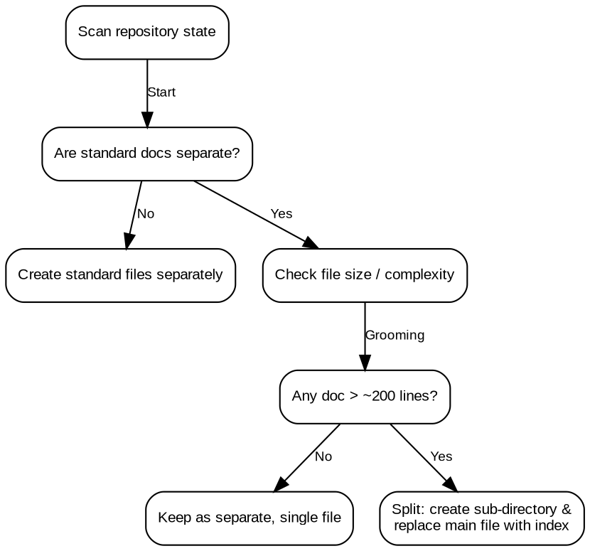

# Organize AI Context

## Overview
Use this skill to help any repo organize its AI agent context into standard files: `CLAUDE.md`, `AGENTS.md`, and `docs/` files (like `ARCHITECTURE.md`, `TESTING.md`, and `DEVELOPMENT.md`).

This skill can be used to either setup a new repository or groom an existing one to realign its project context. Run this periodically to continually align and improve the context—much like weeding a garden.

## Mandatory Step: Task Management
Before taking action, you MUST check if the repository uses BEADS by running the command `bd prime`.
- **If the repository uses BEADS**: You MUST use the `bd` issue tracker for all task management. Do NOT use `todowrite` or custom markdown files. Claim, create, and close issues using `bd` as documented in `bd prime`.
- **If the repository does NOT use BEADS**: You MUST use the `todowrite` tool (or a local markdown file/task tracker if `todowrite` is unavailable) to create a clear checklist of planned work before taking action.

## File Segmentation & Evolution Rule
To maintain a clean and highly readable workspace, you MUST adhere to these segmentation rules:
1. **Never Combine Files**: Do NOT combine architecture, development guidelines, testing rules, or security policies into a single file or into the root `CLAUDE.md`. They MUST live separately under the `docs/` directory.
2. **Standard Initial State**: Every repository must start with the separate individual files listed in the Quick Reference Table below.
3. **Grooming & Evolution**: As these documents grow in size and complexity, do not allow them to become sprawling or unreadable:
   - When any `docs/*.md` file exceeds ~200–300 lines, refactor it into an **index / pointer file**.
   - Move the detailed subsections into a dedicated sub-directory (e.g., `docs/development/style_guide.md`, `docs/development/error_handling.md`).
   - Replace the parent file (e.g., `docs/DEVELOPMENT.md`) with a high-level summary and links/pointers to the modular sub-files.

### File Evolution Flowchart


## Quick Reference: Context Blueprint

| File Path | Theme Statement (Required at Top) | Purpose & Key Contents | Evolution Rule |
| :--- | :--- | :--- | :--- |
| `CLAUDE.md` | *Global rules, command reference, and index to all project context — the only file AI agents need to open first* | Tech stack, build/test commands, CRITICAL Rules, links to docs. | Stays in root; keeps concise (<100 lines). |
| `AGENTS.md` | *Read-only pointer to CLAUDE.md — its only purpose is to redirect to CLAUDE.md and nothing else* | Redirects other agents to read `CLAUDE.md` first. | Stays in root; never modified except to point to `CLAUDE.md`. |
| `docs/ARCHITECTURE.md` | *What is this system? — components, data flow, DB schema, external APIs, and directory layout* | Deep architecture, components, data flows, database schemas. | Split into `/docs/architecture/*` if size > 300 lines. |
| `docs/DEVELOPMENT.md` | *How do we write code here? — naming conventions, design principles, error handling, reliability strategy, and planned stack* | Coding conventions, patterns, naming, design constraints. | Split into `/docs/development/*` if size > 300 lines. |
| `docs/PRODUCT.md` | *What are we building and why? — user story, requirements, success criteria, and business domain context helpful for understanding why features are built the way they are* | Requirements, user stories, success criteria, product vision. | Split into `/docs/product/*` if size > 300 lines. |
| `docs/SECURITY.md` | *How do we keep secrets safe? — environment variables, API key policy, and auth posture* | Environment variables, API key policies, auth posture. | Split into `/docs/security/*` if size > 300 lines. |
| `docs/TESTING.md` | *How do we test and fix bugs? — testing requirements, test running instructions, and bug fix policies.* | Test suite details, execution steps, CI config, bug fix TDD policy. | Split into `/docs/testing/*` if size > 300 lines. |

---

## 1. Scan Phase
Autonomously scan the repository:
- **Tech Stack**: Use `read`, `glob`, `bash` to analyze root config files (e.g., `package.json`, `Cargo.toml`, `requirements.txt`).
- **Testing**: Look for test directories (`tests/`, `__tests__/`, `spec/`) to infer the testing framework.
- **Conventions**: Check any existing `README.md` or `docs/` for current guidelines.

## 2. Interactive Phase
Engage the user to fill in gaps and confirm assumptions using the `question` tool:
- Verify the inferred tech stack.
- Ask for core architectural entry points and design patterns.
- Confirm the bug fix and testing policy (e.g., required CI commands like `just test-unit`).

## 3. Generation Phase
Draft and write the primary context files. **All primary context files MUST require the appropriate theme statement at the top to help align current and future content.** These files must be kept separate as detailed in the File Segmentation & Evolution Rule.

### Enforcing CRITICAL Rules in CLAUDE.md
When generating `CLAUDE.md`, you MUST enforce limiting and curating proper global rules under a SINGLE "CRITICAL Rules" heading. 
**DO NOT create an additional Rules section of any kind.**
- If a rule is truly global, it goes in "CRITICAL Rules".
- If a rule is not global, it MUST go in the appropriate `docs/*` file (e.g., `docs/DEVELOPMENT.md`).

You MUST format the CRITICAL Rules heading exactly as follows:
```md
## CRITICAL Rules

> [!IMPORTANT]
> The following rules are absolute and must be followed by all development agents:
```

You must suggest the following best practice rules for the "CRITICAL Rules" section in every repo:
1. **Git commits**: single-line only with `git commit -m "..."`, no heredoc, no Co-Authored-By. Prefer Conventional Commits style.
2. **Bash syntax checking**: use `bashcheck` — never `bash -n`
3. **After making any changes, run tests**: [concisely instruct how to run tests in the repo]
4. **Bug fixes require TDD tests**: see `docs/TESTING.md` for policy
5. **Creating new skills**: use `superpowers:writing-skills` skill

You MUST preserve and merge any existing, user-defined rules in `CLAUDE.md` and NEVER silently drop them.
You MUST also prompt the user to review and suggest additional global rules when appropriate.

## Common Mistakes
- **Putting everything in the root CLAUDE.md**: Putting detailed architectural diagrams, error-handling conventions, or test scripts in `CLAUDE.md` instead of separate modular `docs/*` files.
- **Combining separate context files**: Thinking a repository is "too simple" and combining `docs/DEVELOPMENT.md` and `docs/TESTING.md` into one single file, violating the separation requirement.
- **Silently dropping user rules**: Overwriting an existing `CLAUDE.md` or `docs/*` file and dropping existing user-defined rules or custom instructions.
- **Forgetting to check for Beads**: Bypassing task tracking or failing to check if the repository uses Beads by running `bd prime` before executing changes.
- **Using Beads on non-Beads repositories**: Running `bd` commands or worrying about Beads tasks when the repository does not use it.
- **Drafting rules without local context**: Generating generic rules (e.g., standard Node/Python test commands) that do not match the actual codebase tech stack.

## Red Flags - STOP
- Any modification to `CLAUDE.md` or `docs/` is made before checking for Beads using `bd prime` (if the repo supports it).
- A `CLAUDE.md` file that exceeds 100 lines or contains architectural design / testing details.
- User-defined rules or custom instructions in `CLAUDE.md` are missing after grooming.
- Context files are combined under `docs/` instead of being kept separate.

## Error Handling
If the repository structure is highly non-standard or overly large to scan efficiently, lean more heavily on the interactive questionnaire to gather context rather than attempting error-prone guesses.
