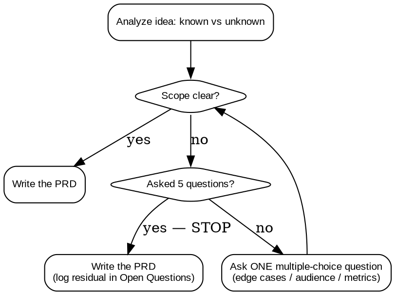

# PRD

## Overview
Use this skill to turn a rough idea into a **Product Requirements Document (PRD)**: a product-focused artifact that a *separate* technical agent later turns into a tech design document.

**Core principle: a PRD captures WHAT and WHY, never HOW.** Define the problem, the users, the boundaries, the user flows, and how you will measure success. Do NOT specify frameworks, databases, APIs, schemas, or architecture — that is the downstream tech-design agent's job.

Pipeline: **idea → PRD (this skill) → tech design → implementation.**

This is NOT `superpowers:brainstorming`. Brainstorming is a pre-code design gate about *how* to build. `prd` is earlier and product-only. Do NOT route this work through brainstorming, and do NOT write the output as a "design" doc or into `docs/superpowers/specs/`.

## The Loop

You are a **Socratic interrogator**. You ask sharp questions to make scope crystal clear, then you write the PRD.

1. **Analyze the idea first.** List what is already known vs. genuinely unknown. Only ask about real gaps — never re-ask something the user already told you.
2. **Ask ONE question per message.** Never send a numbered list of questions in a single message. Multiple-choice (A/B/C/D) preferred over open-ended.
3. **Prioritize the three fuzziest areas:** edge cases, target audience, success metrics. Scope boundaries and user flows are fair game too.
4. **Hard cap: 5 questions, total.** Not "around 5", not "6–8". Five. When you have asked 5 questions — or scope is clear sooner — STOP asking and write the PRD.
5. **If scope is still fuzzy at the cap, write the PRD anyway.** Capture every remaining ambiguity in the **Open Questions / Assumptions** section. Do not keep asking to reach perfection.



## Writing the PRD

Confirm the save path with the user, then write the document to **`docs/prds/YYYY-MM-DD-<slug>.md`** (create `docs/prds/` if missing). Use today's date and a short kebab-case slug from the feature name.

The PRD MUST contain these sections, in this order:

```md
# <Feature Name> — PRD
_Date: YYYY-MM-DD_

## Problem & Goal
<The why, plus a one-sentence goal statement.>

## Target Audience
<Who this is for — personas / user types.>

## Scope — In / Out
**In scope:** <bullets>
**Out of scope:** <bullets — explicit boundaries>

## User Stories
- As a <role>, I want <capability>, so that <benefit>.

## Key User Flows
<Happy path, plus notable alternate flows. Steps, not screens.>

## Functional Requirements
<What the feature must do. Numbered. No implementation detail.>

## Edge Cases
<Boundary conditions, failure states, unusual inputs.>

## Acceptance Criteria
<Testable. Given/When/Then or a checkbox list. Each must be verifiable.>

## Success Metrics
<Measurable outcomes — a number or observable signal, not "users are happy".>

## Open Questions / Assumptions
<Residual ambiguity after the 5-question cap, and assumptions you made.>

## Next Step
Ready for a technical agent to turn this PRD into a tech design document.
```

## Quick Reference

| PRD section | The question that fills it |
| :--- | :--- |
| Target Audience | Who is the primary user, and what's their context? |
| Scope — In / Out | What is explicitly NOT included in v1? |
| User Stories / Flows | What is the main thing a user does, start to finish? |
| Edge Cases | What unusual / failure situations must this handle? |
| Success Metrics | How will we know this succeeded — what do we measure? |

Five sections, five candidate questions. Ask only the ones the idea hasn't already answered.

## Common Mistakes
- **Dumping all questions at once.** A numbered list of questions in one message defeats the Socratic loop. One per message.
- **Exceeding the cap.** Planning "6–8 questions" or sneaking in a sixth. Five is the hard ceiling; write the PRD with Open Questions instead.
- **Writing the *how*.** Naming frameworks, databases, APIs, or architecture. That belongs in the downstream tech design, not the PRD.
- **Routing through brainstorming / wrong location.** Treating this as a pre-code design doc or saving to `docs/superpowers/specs/`. PRDs go to `docs/prds/`.
- **Vague acceptance criteria.** "Works well" is untestable. Each criterion must be verifiable.
- **No measurable success metric.** "Users are happy" is not a metric. Use a number or an observable signal.
- **Skipping Open Questions.** When scope is still fuzzy at the cap, omitting residual ambiguity instead of logging it for the design agent.

## Red Flags - STOP
- About to ask a **6th** question → STOP and write the PRD.
- About to send **multiple questions in one message** → split; send one.
- Writing a **framework / DB / schema / architecture** choice → delete it; that's the tech-design agent's job.
- Saving to `docs/superpowers/specs/` or calling the output a "design doc" → wrong artifact; this is a PRD in `docs/prds/`.
- An acceptance criterion or success metric that **can't be checked or measured** → rewrite it until it can.
