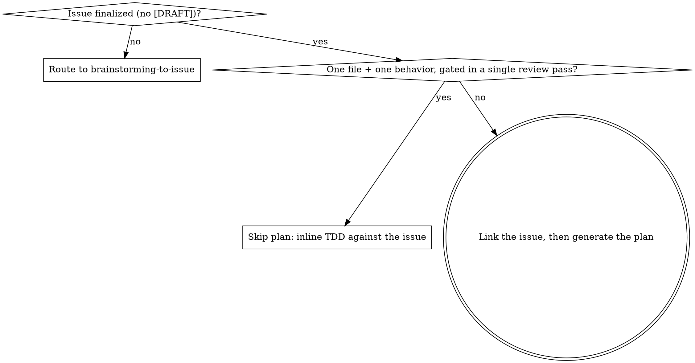

# Issue → Implementation

## Overview

Take a finalized GitHub issue (the durable **what/why** spec produced by `brainstorming-to-issue`) and drive it to merged code — **without** a committed plan document and **without** a human approval gate on the plan. Plan *generation* is delegated wholesale to `superpowers:writing-plans`; only its **persistence** (where the plan lives) and its **handoff** (who decides how to execute) are overridden.

**Core principle:** the issue is the durable spec; the plan is ephemeral **how**. So the plan lives in per-run scratch and is mirrored into the PR description at the end — never committed under `docs/`. Execution auto-hands to `superpowers:subagent-driven-development`; there is no "which approach?" question.

This is the exact inverse of `brainstorming-to-issue`: that skill reuses brainstorming's dialogue but diverts its *docs/ + writing-plans* tail into an issue; **this** skill reuses writing-plans' *generation* but diverts its *docs/ + human-choice* tail into scratch + auto-SDD.

## When to Use

- A finalized (non-`[DRAFT]`) issue exists and you're ready to build it now.
- The work is more than one test-and-commit: multiple files, or two-plus independently reviewable deliverables, or interfaces between units.

**When NOT to use:**
- The issue is still `[DRAFT]` or the spec isn't settled → use `superpowers:brainstorming` / `brainstorming-to-issue` first.
- The change is trivial (see the gate below) → skip planning entirely and go straight to `superpowers:test-driven-development`.

## Entry Gate

Decide **before** generating anything.

**Triviality predicate (observable):** the whole change is one file touched, one logically independent behavior, and a single reviewer could gate it in one red-green-commit pass. If you're unsure whether it splits into 2+ reviewable units, that uncertainty means it is **not** trivial — plan it. Never skip the plan just because the issue text is short.

## Link the Issue First

Before generating the plan, bind to the real tracker item (this is where ad-hoc runs drift):

1. `gh issue view <N>` — confirm it is the finalized spec and carries no `[DRAFT]` prefix. If it does, stop and route to `brainstorming-to-issue`.
2. Claim it per this repo's rule: comment `/claim` (or self-assign) and mark it in-progress.
3. Record `Closes #<N>` — it goes in the PR body at the end.

Exact commands: `plan-and-dispatch.md`.

## Generate the Plan (delegated, then diverted)

**REQUIRED SUB-SKILL:** Run `superpowers:writing-plans` to generate the plan from the issue body — File Structure, Task Right-Sizing, **Global Constraints copied verbatim from the issue's requirements**, per-task Interfaces (Consumes/Produces), bite-sized TDD steps, and its Self-Review. Generate it exactly as that skill describes.

<HARD-OVERRIDE>
`superpowers:writing-plans` ends by saving to `docs/superpowers/plans/YYYY-MM-DD-<name>.md`, committing, and offering the human an execution choice ("Which approach?"). When using THIS skill you do NONE of that:

- Do NOT save the plan under `docs/`. Write it to **`.superpowers/sdd/plan.md`** inside the execution worktree (the same git-ignored scratch dir SDD already uses for briefs and its progress ledger). Ensure the path is ignored via SDD's nested-ignore convention — never by editing the tracked root `.gitignore` (see `plan-and-dispatch.md`).
- Do NOT commit the plan. It is scratch, not a tracked artifact. Its durable home is the PR description, added at the end.
- Do NOT ask "which execution approach?" — there is no human gate here. Auto-select subagent-driven execution.

The issue is the durable *what*; this scratch plan is the ephemeral *how*.
</HARD-OVERRIDE>

## Auto-Handoff to Execution

**REQUIRED SUB-SKILL:** Use `superpowers:subagent-driven-development`, pointing its `scripts/task-brief` at `.superpowers/sdd/plan.md`. Do not pause for approval between generating the plan and dispatching Task 1 — the human already approved at issue finalization.

SDD ends via `superpowers:finishing-a-development-branch`, which opens the PR. **The PR description MUST contain the plan (the ephemeral how) and `Closes #<N>`** — that is where the plan becomes durable. It never returns to `docs/` and never lands on the issue.

## Common Mistakes

| Mistake | Fix |
|---|---|
| Saving the plan to `docs/superpowers/plans/` (writing-plans' default) | Divert to `.superpowers/sdd/plan.md` per HARD-OVERRIDE |
| Committing the plan file | Never commit it — it's scratch; it goes in the PR body at the end |
| Asking the human "which execution approach?" | No plan gate — auto-hand to subagent-driven-development |
| Re-deriving task decomposition by hand | Delegate generation entirely to `writing-plans` — don't reinvent it |
| Planning a trivial one-file change | Apply the entry gate — trivial ⇒ inline TDD, no plan, no SDD |
| Building a `[DRAFT]` issue | Not finalized — route back to `brainstorming-to-issue` |
| Never claiming / linking the real issue | `gh issue view <N>`, claim + in-progress, carry `Closes #<N>` to the PR |
| Plan ends up nowhere durable (only in lost context) | Mirror it into the PR description via the finishing step |

## Red Flags — STOP

- About to write the plan under `docs/` or `git commit` it
- About to ask the human to pick an execution mode
- About to hand SDD an issue with no plan file, or re-derive tasks yourself
- Running full plan + SDD on a change that's one file and one behavior
- The issue title still says `[DRAFT]`
- The plan exists only in conversation with no `.superpowers/sdd/plan.md` on disk

All of these mean: divert the plan to scratch, keep the human out of the plan gate, and let the issue (durable what) and PR (durable how) be the only persisted artifacts.
